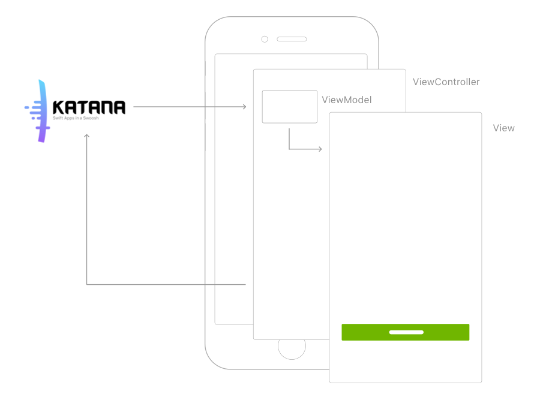

# Tempura

Tempura is a UI (and Navigation) framework for Katana.
With Tempura you can use Katana to handle the logic part of your app while still using the native iOS navigation and UI elements, being able to leverage system features like peek and pop and automatic transitions between screens.

|      | Tempura                                   |
| ---- | ---------------------------------------- |
| 📱   | Use native UIKit elements |
| 🚢   | Use iOS native navigation |
| ✨   | Automatically update the UI based on state changes|
| 📐   | Layout agnostic, use your favorite layouting system |
| 🦄   | Detach from the state to handle complex scenarios|
| 🎩   | Supports Peek&Pop, 3D touch shortcuts |
| 🐎   | Native Animations, including ViewControllers transitions |


# Anatomy of a Screen
In Tempura, a Screen is composed by three different components that interoperate to get the actual pixels on the screen and to keep them updated when the state changes.
These are: `ViewController`, `View` and `ViewModel`.




## ViewController

A ViewController manages the set of views that are shown in each screen of your UI.

Responsibilities of a ViewController are:

- listen for Katana state changes and propagate them to the view
- listen for user interactions and dispatch new Katana Actions

Tempura will handle the former for you, you will only need to address the latter


## ViewModel

The ViewModel is a lightweight object that selects part of the State for the View and transforms it to be easily consumed by the View itself.

This has some advantages:

- a ViewModel is easier to test than the UI
- the View becomes just a dumb presentation layer

## View

The view is what you actually see on screen, it contains no business logic (it can contain UI logic, like handling a CollectionView delegate), it only presents itself based on the content of the viewModel. The lifecycle of a view contains:

- setup phase, when you create the children UI elements like buttons or labels
- style phase, when you define the cosmetics of the view and its children
- layout phase, when you layout the children of the view
- update phase, when you update the view and its children based on a new viewModel that is available


# Show me the code

## setup the katana Store

Your entire app state is defined as a single struct:

```swift
struct CounterState: State {
var counter: Int = 0
}
```

In your `AppDelegate` you will instantiate the katana store using the CounterState

```swift
self.store = Store<CounterState>(middleware: [], dependencies: DependenciesContainer.self)
```


## defining the actions

The Katana `state` can only be modified through `Actions` so let's define actions to Increment and Decrement the counter:

```
struct IncrementCounter: AppAction {
func updatedState(state: inout CounterState) {
state.counter = state.counter + 1
}
}
```

```
struct DecrementCounter: AppAction {
func updatedState(state: inout CounterState) {
state.counter = state.counter - 1
}
}
```


## create your first screen

let's start using `Tempura` to create our first screen where we can look at the value of the counter and increment and decrement it.

### define the ViewModel

the property we need from the state is the value of the counter, we then transform it to be used by the View.

```swift
struct CounterViewModel: ViewModel {
var count: String = ""

init(state: CounterState) {
self.count = "the counter is at \(state.counter)"
}

init() {}
}
```

please note that the ViewModel is the place where we transform the `counter: Int` that we have in the state to a `count: String` that contains the description of the counter that the View wants to display.

Reasons for doing this are:

- the `count: String` is **easier for the view to be consumed**, this goes in the direction of having the **dumbest possible View layer**
- **testing** the ViewModel will let us test the UI


### create the View

the view is what we will have on screen. We want a label to show the value of counter and two buttons to increment and decrement the counter.

```swift
class MainView: CounterView<CounterViewModel> {

// #1 define the children elements
var counter: UILabel = {
let l = UILabel()
return l
}

var sub: UIButton = {
let b = UIButton()
return b
}

var add: UIButton = {
let b = UIButton()
return b
}

// #2 Setup, here we add children elements to the view
override func setup() {
self.addSubview(self.counter)
self.addSubview(self.sub)
self.addSubview(self.add)
self.sub.addTarget(self, action: #selector(self.subDidTap), for: .touchUpInside)
self.add.addTarget(self, action: #selector(self.addDidTap), for: .touchUpInside)
}

// #3 Style, define the style of the view and the children elements
override func style() {
self.backgroundColor = .white
self.counter.textAlignment = .center
self.sub.backgroundColor = .red
self.sub.setTitle("sub", for: .normal)
self.add.backgroundColor = .blue
self.add.setTitle("add", for: .normal)
}

// #4 Update, the state is changed, here we update the view accordingly
override func update(model: CounterViewModel, oldModel: CounterViewModel) {
self.counter.text = model.count
}

// #5 Interaction, define and trigger callbacks for interactions
var subtractButtonDidTap: Interaction?
var addButtonDidTap: Interaction?

@objc private func subDidTap() {
self.subtractButtonDidTap?()
}

@objc private func addDidTap() {
self.addButtonDidTap?()
}

// #6 Layout, layout the children elements
override func layout(model: MainViewModel) {
...
}

}
```


### create the ViewController

every time the state changes, the ViewController will instantiate a ViewModel from the new state and feed the View with that, triggering the `update(...)` method. The other responsibility of the ViewController is to listen to interaction callbacks from the View and trigger actions to change the state.

```swift
class CounterViewController: ViewController<CounterView, CounterViewModel, CounterState> {

// #1 listen for interaction callbacks from the view
override func setupInteraction() {
self.rootView.addButtonDidTap = self.addButtonDidTap
self.rootView.subtractButtonDidTap = self.subtractButtonDidTap
}

// #2 trigger actions
func addButtonDidTap() {
self.dispatch(action: IncrementCounter())
}

func subtractButtonDidTap() {
self.dispatch(action: DecrementCounter())
}
}
```

as you can see you only need to handle interactions from the view, **there is no boilerplate needed to handle the updates from the state**, everything come for free subclassing `ViewController`


# Handling the navigation

so far we shown how to handle a single UI screen and how to keep it updated when the state changes.
When it comes to create a real app, the way you handle the navigation between screens is an important factor on the final result.

We believe that using the native iOS navigation is the right choice for our stack, because:

- no navigation code to write and maintain, just to mimic the way native navigation works
- native navigation gestures will come for free and will stay up to date with new iOS releases
- the app will feel more "native"

for these reasons with `Tempura` we found a way to reconcile the redux-like world of katana with the imperative world of the iOS navigation.


## the Routable protocol

if a Screen (read ViewController) takes an active part on the navigation (i.e. needs to present another screen) it must conform to the `Routable` protocol:

```swift
protocol Routable {
var routeIdentifier: RouteElementIdentifier { get }
}
```

```swift
typealias RouteElementIdentifier = String
```

## the route

a route is an array that represents a navigation path to a specific screen:

```swift
typealias Route = [RouteElementIdentifier]
```

## the navigation actions

Tempura exposes these navigation actions:

```swift
Navigate(to route: Route, animated: Bool)
```

navigate to a specific screen identified by `Route`. This is useful for instance when outside the app you want to 3d touch the icon and say something "edit last video", that means navigate to the specific screen that will let you use the editor.

```swift
Push(to route: Route, animated: Bool)
```

starting from the active screen ask to push sequentially the screens specified in the route. This means that if the route is ["C", "D"] and you dispatch a request to push that route when the active navigation is at ["A", "B"] (so B is the active Screen), the final route of the app will be ["A", "B", "C", "D"] (where D is the active screen)

```swift
Pop(animated: Bool)
```

ask to dismiss the topmost Screen in the navigation

```swift
PresentModally(screen: RouteElementIdentifier, animated: Bool)
```

present modally the screen on top of the navigation stack. This is different from a Push because a request to present a screen modally will follow a different request path to save boilerplate when implementing the navigation. We will go into detail in the `Navigator` section

```swift
DismissModally(screen: RouteElementIdentifier, animated: Bool)
```

the counterpart of the `PresentModally`


## the navigator

when you send a navigation action like `Navigate(to: ["ScreenA", "ScreenB", "ScreenC"])` the Navigator starts working under the hood to make the navigation happen.
Let's see the steps involved:

1. ViewController sends the action `Navigate(to: ["ScreenA", "ScreenB", "ScreenC"])`

2. the Navigator receives the request and asks the system for the actual navigation route at this specific moment in time. Let's say that the system responds with `["ScreenA, "ScreenD"]`

3. the Navigator analyzes the current and the requested route and extracts an array of navigation actions to go from the old route to the new, in this case the actions are something like:

- ask "ScreenA" to change from "ScreenD" to "ScreenB"

- ask "ScreenB" to push "ScreenC"

these tasks are then executed in order:

4. first task is executed, the Navigator needs to ask "ScreenA" to change to "ScreenD".
This means that "ScreenA" has an active role in the navigation, this means that it must implement `Routable` protocol, otherwise an informative fatalError will be raised.

5. "ScreenA" (that is probably a TabBarController) implements the `change(...)` method of `Routable` protocol and has all the informations to interpret the request (in this case it only needs to change the selected tab from D to B)

6. next task is executed, "ScreenB" is asked (through the routable protocol) to `Push` the "ScreenC". Again, B knows how to interpret that request and the navigation is completed

this approach has a **great level of flexibility** for different reasons:

- **the navigation is local**, meaning that every Screen knows how to best handle the specific segment of navigation
- this support the whole set of **transitioning animations**
- this also **support all the navigations that are not happening through navigation actions**, like when a user tap the back button or a user edge swipes to go back (because the Navigator is looking at the actual Screens on the stack every time, and not at a navigation state that cannot be updated without actions)


## the AppNavigation file

we suggest to organize the navigation of the application in a single file `AppNavigation.swift` where you can place all the conformances to Routable for the screens that are actively partecipating to the navigation

```swift
extension ScreenB: Routable {
var routeIdentifier: RouteElementIdentifier {
return Screen.home.rawValue
}

func push(identifier: RouteElementIdentifier, animated: Bool, completion: @escaping RoutingCompletion) {
if identifier == Screen.screenC.rawValue {
let sc = ScreenC()
self.navigationController?.pushViewController(sc, animated: animated)
completion()
}
}
}

extension ScreenC: Routable {
var routeIdentifier: RouteElementIdentifier {
return Screen.screenC.rawValue
}

func pop(identifier: RouteElementIdentifier, animated: Bool, completion: @escaping RoutingCompletion) {
self.popViewController(animated: animated)
completion()
}
}
```


## modals

modals are a special case in the navigation structure.
If we have a screen that we want to present modally, chances are that there are different places where we want to display it.

For instance let's suppose we have the usual route ["ScreenA", "ScreenB", "ScreenC"] and we want to modally present "ScreenM".
The modal could be presented in all of these three screens.

This can evolve in three different scenarios:
1. the current stack is ["ScreenA"] and we want to present "ScreenM" modally
2. the current stack is ["ScreenA", "ScreenB"] and we want to present "ScreenM" modally
3. the current stack is ["ScreenA", "ScreenB", "ScreenC"] and we want to present "ScreenM" modally

to address all these three situations, all the A, B, and C should implement `Routable` and the `presentModally` method, with the same implementation, just to account the fact that the screen asked to present M is different in each scenario.


To avoid this, the implementation of `presentModally` returns a Bool value that the Navigator is using to understand if the screen is handling the modal. If it's not the case, the next Screen will be asked to present it.
With this approach, you can write the code to handle the modal only once, placing it at the lowest level of the navigation hierarchy, that is "ScreenA".

The steps involved are:

1. ViewController sends the action `PresentModally(screen: "ScreenM")`
2. the Navigator receives the request and asks the system for the actual navigation route at this specific moment in time. Let's say that the system responds with `["ScreenA, "ScreenB", "ScreenC"]`
3. the Navigator analyzes the current and the requested route and extracts an array of navigation actions to go from the old route to the new, in this case there is only one action that is:
- ask "ScreenC" to modally present "ScreenM"
4. the Navigator asks C to present M. "ScreenC" is not implementing the `presentModally(...)` method of `Routable` and the default implementation returns `false`. This means that C is not handling the modal, hence the Navigator will asks to the next screen in line
5. the Navigator asks B to present M. Same as before, B is not handling the modal
6. the Navigator asks A to present M. "ScreenA" is implementing the `presentModally(...)` method that contains all the infos to present M (like the top ViewController for instance) and the navigation is completed


